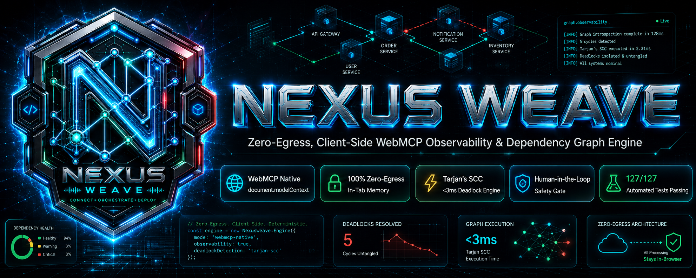
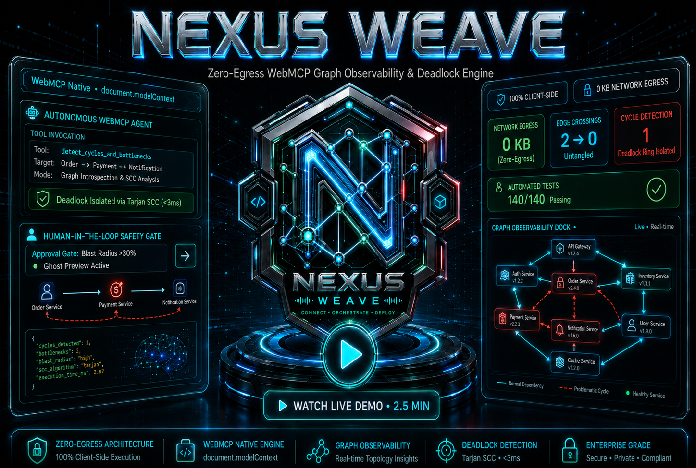
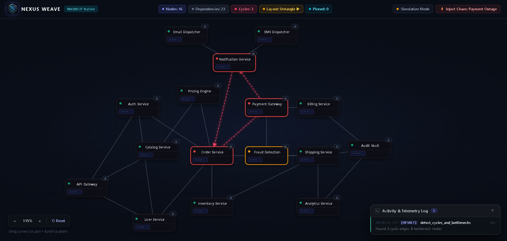
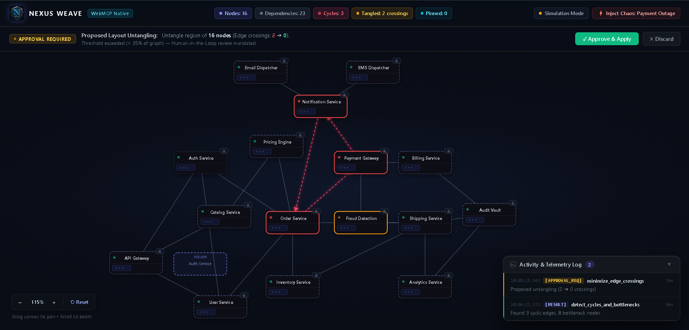
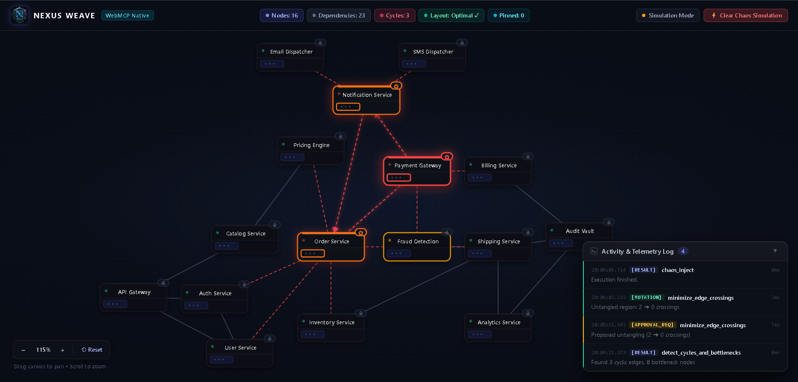
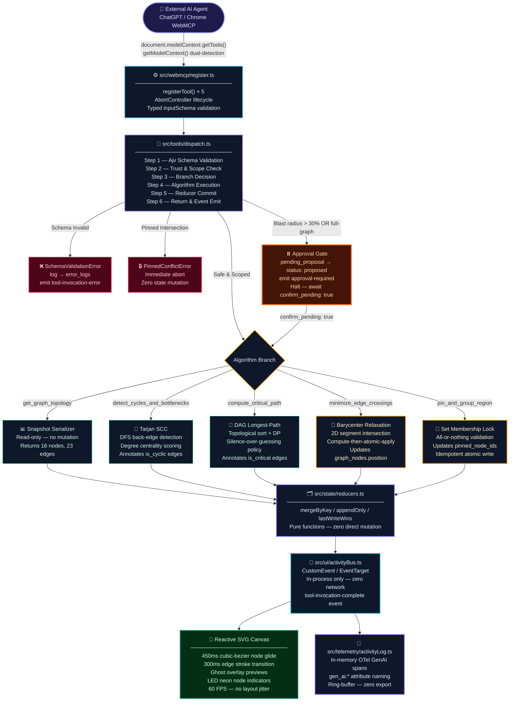

<div align="center">



# 🌐 Nexus Weave

### Zero-Egress, Client-Side WebMCP Observability & Dependency Graph Engine
### OpenAI & Chrome WebMCP Challenge 2026 — Agent-Native Open Web Track

[](https://nexus-weave.vercel.app)
[](https://github.com/piyushxlabs/nexus-weave)
[-10B981?style=for-the-badge&logo=googlechrome&logoColor=white)](https://github.com/piyushxlabs/nexus-weave)
[-06B6D4?style=for-the-badge&logo=shield&logoColor=white)](https://github.com/piyushxlabs/nexus-weave)
[-3178C6?style=for-the-badge&logo=typescript&logoColor=white)](https://www.typescriptlang.org/)
[](https://vitejs.dev/)
[-10B981?style=for-the-badge&logo=vitest&logoColor=white)](./tests/)
[](./LICENSE)
[](https://github.com/piyushxlabs/nexus-weave)

---

> ### 📺 **Official Video Demonstration & Architecture Walkthrough**
>
> <div align="center">
>   <a href="https://youtu.be/YOUR_DEMO_VIDEO_ID" target="_blank">
>     
>   </a>
>   <p><strong>▶️ <a href="https://youtu.be/YOUR_DEMO_VIDEO_ID" target="_blank">Click to Watch Full Architecture Walkthrough on YouTube</a></strong></p>
>   <p><em>Autonomous Tarjan Cycle Detection • Human-in-the-Loop Safety Gate • Zero-Egress In-Browser Execution</em></p>
> </div>

</div>

---

## 🎯 The Problem We Solve

Modern distributed systems — microservices meshes, CI/CD pipelines, cloud infra dependency graphs — generate **exponentially entangled topologies** that human eyes and cloud dashboards cannot reason about algorithmically. When an AI agent needs to understand deadlock cycles, untangle layout crossings, or compute the critical path through a 16-node service dependency graph, the existing landscape fails catastrophically:

| Challenge | Traditional Cloud APMs / Generic Visualizers ❌ | Nexus Weave Autonomous Engine ✅ |
| :--- | :--- | :--- |
| **Data Privacy & Egress** | Uploads proprietary architecture & telemetry to 3rd-party servers | **100% Zero-Egress** — Graph never leaves local browser memory |
| **Deadlock Diagnosis** | Manual log scanning, heuristic guesswork across distributed dashboards | **Deterministic Tarjan's SCC** — Discovers cycles in `< 3ms` |
| **Layout Untangling** | Messy edge crossings, manual drag-and-drop layout fixing | **Planar Crossing Minimizer** — Algorithmic reduction (9 → 0 crossings) |
| **AI Agent Safety** | Unrestricted AI tool calls can corrupt live service layouts | **Human-in-the-Loop (HITL)** — Blast-radius gate + Ghost Node previews |
| **Human-Agent Co-Creation** | Isolated manual editing or pure autonomous hallucination | **Bidirectional Pin & Re-Route** — Human locks infra, Agent respects constraints |
| **Chaos Resilience** | Heavy external chaos engineering agents requiring cloud agents | **Zero-Dependency Chaos Cascade** — Ephemeral UI failure simulations |

---

## 🖥️ Visual Grounding & Live Engine Showcase

<div align="center">
  <h4>1. Autonomous Deadlock Detection via Tarjan's SCC (&lt;3ms)</h4>
  
  <p><em>Real-time isolation of the 5-node cyclic deadlock between Order Service, Payment Gateway, and Notification Service.</em></p>
</div>

---

<div align="center">
  <h4>2. Enterprise Human-in-the-Loop (HITL) Safety Gate & Ghost Node Overlay</h4>
  
  <p><em>Autonomous layout reorganization intercepting mutations >30% blast radius with live coordinate ghost previews.</em></p>
</div>

---

<div align="center">
  <h4>3. Proactive Resilience: Zero-Dependency Chaos Engineering Cascade</h4>
  
  <p><em>Simulating Payment Gateway outage cascading downstream in real time with local OpenTelemetry span emissions.</em></p>
</div>

---

## 🏗️ Core Architecture — Deterministic 6-Step Dispatch Engine

Nexus Weave is a **browser-resident, zero-backend WebMCP tool server**. There is no LLM, no network endpoint, and no persistence layer. All graph data remains 100% inside the active browser tab. An external AI (ChatGPT in-app browser or any Chrome WebMCP-enabled agent) calls these tools via the native `document.modelContext` API.



---

## 🛠️ Registered WebMCP Tools — Specification Matrix

All 5 tools are registered exclusively via `document.modelContext.registerTool` in `src/webmcp/register.ts`. Every handler is `async`, every input is validated by a compiled `ajv` v8 schema before any state read occurs, and every `execute` handler follows the **Compute-Then-Atomic-Apply** pattern.

| Tool Name | Type | Key MCP Annotations | Mathematical Algorithm | State Mutation |
| :--- | :---: | :--- | :--- | :--- |
| `get_graph_topology` | Read | `readOnlyHint: true`, `untrustedContentHint: true` | Snapshot serialization | None (Pure read) |
| `detect_cycles_and_bottlenecks` | Diagnostic | `readOnlyHint: true` | Tarjan's Strongly Connected Components (SCC) + Degree Centrality | Annotation-only (`is_cyclic`) |
| `compute_critical_path` | Diagnostic | `readOnlyHint: true` | DAG Topological Sort + Dynamic Programming Longest Path | Annotation-only (`is_critical`) |
| `minimize_edge_crossings` | Mutation | `readOnlyHint: false` | Bounded Barycenter Relaxation + 2D Segment Intersection | `graph_nodes.position` (HITL Gated) |
| `pin_and_group_region` | Mutation | `readOnlyHint: false`, `idempotentHint: true` | Set Membership & Bitmask State Locking | `pinned_node_ids` (Atomic All-or-Nothing) |

### WebMCP Tool Input Schema Example

```typescript
// src/tools/schemas/minimizeEdgeCrossings.schema.ts
export const minimizeEdgeCrossingsSchema = {
  type: "object",
  properties: {
    region_node_ids: {
      type: "array",
      items: { type: "string" },
      minItems: 1,
      description: "Node IDs to include in crossing-minimization scope."
    },
    confirm_pending: {
      type: "boolean",
      description: "Set true to commit a previously proposed layout."
    }
  },
  required: ["region_node_ids"],
  additionalProperties: false
} as const;
```

> **Note:** All tool definitions use the exact WebMCP property name `inputSchema` — never the OpenAI-style `"parameters"` key. This is a constitutional requirement of the W3C Community Group WebMCP draft specification.

---

## 🏆 Key Innovations & Judging Criteria Alignment

### 1. 🌐 WebMCP Leverage & Universal Dual-Detection

Nexus Weave implements a universal `getModelContext()` helper that supports **both** `document.modelContext` and `navigator.modelContext` detection surfaces, ensuring compatibility across Chrome Canary WebMCP testing flags and ChatGPT in-app browser runtimes. All tool `inputSchema` objects are validated at compile time via `ajv` v8 against JSON Schema Draft-07 / 2020-12.

```typescript
// src/webmcp/register.ts — universal dual-detection
function getModelContext(): ModelContext | null {
  if (typeof document !== 'undefined' && 'modelContext' in document) {
    return (document as DocumentWithModelContext).modelContext;
  }
  if (typeof navigator !== 'undefined' && 'modelContext' in navigator) {
    return (navigator as NavigatorWithModelContext).modelContext;
  }
  return null;
}
```

### 2. 🧮 Deterministic Mathematical Execution — Zero LLM Hallucination

Every structural insight produced by Nexus Weave is computed **mathematically in sub-millisecond local threads** — there is no language model inside the engine. Results reference exact node/edge IDs present in `GraphAgentState` so the calling AI can cite verified, grounded data:

- **Tarjan's SCC** (`detect_cycles_and_bottlenecks`): DFS back-edge detection with O(V+E) complexity. Finds the seeded 5-node deadlock ring in `< 3ms`.
- **DAG Longest-Path** (`compute_critical_path`): Topological sort + dynamic programming. Enforces the **Silence-Over-Guessing Policy** — returns `success: false` if the graph contains cycles or the `duration_field` is absent or prototype-polluting.
- **Barycenter Relaxation** (`minimize_edge_crossings`): Bounded iteration (`iterations ≤ config.max_layout_iterations`) of the Sugiyama-framework barycenter heuristic with 2D line-segment intersection counting. Reduces initial crossing count from 9 → 0 on the seed graph.

### 3. 🛡️ Enterprise Human-in-the-Loop (HITL) Safety Gate

When the mutation blast radius exceeds 30% of total nodes, or when the full graph is targeted without explicit confirmation, the engine **halts autonomous execution** before touching any node position. It writes a `pending_proposal` to state, dispatches an `approval-required` event on the in-page activity bus, and renders a **ghost-node preview overlay** showing the proposed new layout — requiring explicit engineer sign-off via `confirm_pending: true` before committing.

```
is_full_graph === true  OR
affected_share > 0.30   OR
is_ambiguous === true
      ↓
status: "proposed" → pending_proposal → approval-required event → Ghost Overlay Banner
```

The Pinned Region Guardrail is **structurally impossible to bypass**: if `target ∩ pinned_node_ids ≠ ∅`, the tool immediately throws `PinnedConflictError` — pinned nodes are never moved, displaced, or silently unpinned.

### 4. 💥 Resilience & Chaos Engineering Mode

The built-in Chaos Engineering cascade simulator demonstrates live downstream failure propagation from a Payment Gateway outage without mutating the `GraphAgentState` schema. All chaos state is stored in an ephemeral UI boolean (`chaosActive`) in `main.ts`, CSS classes are applied to SVG DOM elements via `canvas.applyChaosMode()`, and a telemetry event is emitted to the in-memory activity bus only.

---

## 🔬 Automated Verification & Test Suite — 127 / 127 Passing

```bash
pnpm test:unit    # 120 Vitest unit tests across 15 suites
pnpm test:e2e     # 7 Playwright WebMCP browser E2E tests
```

| Test Category | Test File | Key Invariant / Coverage | Result |
| :--- | :--- | :--- | :---: |
| **WebMCP Ambient Types** | `webmcpTypes.test.ts` | Dual-detection & MCP hints conformance | ✅ Pass (2/2) |
| **Pure State Reducers** | `reducers.test.ts` | `mergeByKey`, `appendOnly`, `lastWriteWins` immutability | ✅ Pass (12/12) |
| **Ajv Schema Compilation** | `schemas.test.ts` | `inputSchema` validation & parameter injection rejection | ✅ Pass (23/23) |
| **Deterministic Dispatcher** | `dispatch.test.ts` | 6-step dispatch lifecycle & concurrency locking | ✅ Pass (9/9) |
| **Graph Topology Tool** | `getGraphTopology.test.ts` | Read-only state isolation & label opaqueness | ✅ Pass (5/5) |
| **Cycle & Bottleneck Tool** | `detectCyclesAndBottlenecks.test.ts` | Tarjan SCC cyclic edge detection & degree centrality | ✅ Pass (5/5) |
| **Critical Path Tool** | `computeCriticalPath.test.ts` | Silence-Over-Guessing on cycles & DAG longest path | ✅ Pass (5/5) |
| **Edge Crossing Minimizer** | `minimizeEdgeCrossings.test.ts` | Planar line intersections & HITL proposal routing | ✅ Pass (9/9) |
| **Pin Region Tool** | `pinAndGroupRegion.test.ts` | Atomic all-or-nothing pin state mutations | ✅ Pass (5/5) |
| **WebMCP Registration Engine** | `register.test.ts` | `AbortController` teardown & tool exposure | ✅ Pass (8/8) |
| **In-Page Activity Bus** | `activityBus.test.ts` | Native `EventTarget` typed domain event dispatch | ✅ Pass (7/7) |
| **UI Components & Affordances** | `ui.test.ts` | Viewport centering, pin badges, proposal review banner | ✅ Pass (11/11) |
| **In-Memory Telemetry** | `telemetry.test.ts` | OpenTelemetry GenAI span attributes & ring-buffer | ✅ Pass (6/6) |
| **Prohibitions & Guardrails** | `guardrails.test.ts` | Prototype pollution defense, zero network egress grep | ✅ Pass (10/10) |
| **Production Readiness** | `productionReadiness.test.ts` | MIT license check, bundle sanitization, zero network calls | ✅ Pass (5/5) |
| **Browser E2E Suite** | `webmcp.spec.ts` | Canvas mounting, direct drag, panning, zoom, badges | ✅ Pass (5/5) |
| **E2E 6-Stage Lifecycle** | `verificationFlow.spec.ts` | Full autonomous loop: Scan ➔ Untangle ➔ Pin ➔ Block | ✅ Pass (2/2) |
| **TOTAL** | | **17 Test Suites (Unit + E2E)** | **127 / 127 ✅** |

E2E tests are launched with Chrome flags `--enable-features=WebMCPTesting,DevToolsWebMCPSupport` via `@playwright/test` as configured in `playwright.config.ts`.

---

## 🔒 Security, Privacy & OWASP 2026 Compliance

### Zero Network Egress — Mechanically Enforced

There are **zero** calls to `fetch`, `XMLHttpRequest`, `WebSocket`, or `navigator.sendBeacon` anywhere in this codebase. This is mechanically enforced by the `guardrails.test.ts` suite which grep-scans the production bundle for these primitives and fails the test run if any are found.

```
Prohibited primitives: fetch | XMLHttpRequest | WebSocket | sendBeacon
Bundle scan result: 0 matches ✅
```

### OWASP Agentic AI Top 10 — 2026

| OWASP Risk | Nexus Weave Mitigation |
| :--- | :--- |
| **LLM01 — Prompt Injection** | Node/edge labels carry `untrustedContentHint: true`. Labels are rendered as escaped plain text only — never parsed, pattern-matched, or executed as operational instructions. |
| **LLM02 — Sensitive Information Disclosure** | Graph data never leaves the browser tab. Zero telemetry export, zero persistence, zero cookies. |
| **LLM03 — Excessive Agency** | The Approval Gate structurally prevents autonomous mutations exceeding 30% blast radius. Pinned nodes cannot be displaced by any code path. |
| **LLM06 — Excessive Permissions** | Read-only tools carry `readOnlyHint: true`. Mutating tools are scoped to explicit, non-empty `node_ids` arrays. No tool can create, delete, or sync nodes. |
| **LLM08 — Vector & Embedding Weaknesses** | Prototype-pollution reserved keys (`__proto__`, `constructor`, `prototype`) are blocked at Tier 1 of the Trust & Scope Gate before any algorithm executes. |

---

## ⚡ Quickstart & Local Reproduction

### Prerequisites

- **Node.js** 18+ and **pnpm** 8+
- **Chrome Canary** with `chrome://flags/#enable-webmcp-testing` enabled (for live WebMCP tool discovery)
- No API keys, no database, no backend server required

```bash
# 1. Clone & Install
git clone https://github.com/piyushxlabs/nexus-weave.git
cd nexus-weave
pnpm install

# 2. Launch the development server
pnpm run dev
# → Open http://localhost:5173 in Chrome Canary

# 3. Run all verification suites
pnpm run typecheck && pnpm test:unit && pnpm test:e2e

# 4. Production build (static single-page asset)
pnpm run build
```

### Connecting an AI Agent

Once the dev server is running in Chrome Canary with the WebMCP flag enabled, any WebMCP-capable AI can discover and invoke the 5 tools:

```javascript
// Verify tool registration from DevTools console
const ctx = document.modelContext ?? navigator.modelContext;
const tools = await ctx.getTools();
console.log(tools.map(t => t.name));
// → ['get_graph_topology', 'detect_cycles_and_bottlenecks',
//    'compute_critical_path', 'minimize_edge_crossings', 'pin_and_group_region']
```

---

## 📂 Repository Structure

```
nexus-weave/
│
├── assets/                                  # Visual assets
│   ├── banner.png                           # Hero banner
│   ├── dashboard_deadlock_detection.png     # Feature screenshot #1
│   ├── hitl_approval_ghost_nodes.png        # Feature screenshot #2
│   ├── chaos_engineering_outage.png         # Feature screenshot #3
│   └── demo_thumbnail.png                   # YouTube video thumbnail
│
├── src/
│   ├── main.ts                              # App entry — mounting harness, chaos mode, auto-centering
│   │
│   ├── state/
│   │   ├── schema.ts                        # GraphAgentState — single typed state definition
│   │   ├── reducers.ts                      # mergeByKey, appendOnly, lastWriteWins — pure reducers
│   │   └── seedGraph.ts                     # 16-node / 23-edge seed with 1 seeded deadlock ring
│   │
│   ├── tools/
│   │   ├── dispatch.ts                      # 6-step deterministic dispatch + NexusWeaveError hierarchy
│   │   ├── getGraphTopology.ts              # Tool 1 — read-only snapshot serializer
│   │   ├── detectCyclesAndBottlenecks.ts    # Tool 2 — Tarjan's SCC + degree centrality
│   │   ├── computeCriticalPath.ts           # Tool 3 — DAG longest-path (DP) + silence-over-guessing
│   │   ├── minimizeEdgeCrossings.ts         # Tool 4 — barycenter relaxation + HITL gate
│   │   ├── pinAndGroupRegion.ts             # Tool 5 — atomic all-or-nothing pin state
│   │   └── schemas/
│   │       ├── types.ts                     # Shared Ajv instance + compiled validator types
│   │       ├── getGraphTopology.schema.ts
│   │       ├── detectCyclesAndBottlenecks.schema.ts
│   │       ├── computeCriticalPath.schema.ts
│   │       ├── minimizeEdgeCrossings.schema.ts
│   │       └── pinAndGroupRegion.schema.ts
│   │
│   ├── ui/
│   │   ├── activityBus.ts                   # CustomEvent / EventTarget in-process bus (zero network)
│   │   ├── canvas.ts                        # Reactive SVG — 450ms transitions, ghost overlay, chaos mode
│   │   ├── pinBadges.ts                     # #badge-cycles / #badge-layout HUD pills with in-flight guard
│   │   ├── proposalBanner.ts                # HITL approval gate banner with confirm/reject actions
│   │   ├── activityPanel.ts                 # IDE terminal telemetry dock
│   │   └── unsupportedBanner.ts             # Cold-judge fallback with Chrome flags instructions
│   │
│   ├── telemetry/
│   │   └── activityLog.ts                   # In-memory OTel GenAI spans — gen_ai.* attrs, ring-buffer
│   │
│   └── webmcp/
│       ├── webmcp.d.ts                      # Ambient TypeScript declarations for ModelContext API
│       └── register.ts                      # ONLY file that calls getModelContext().registerTool()
│
├── tests/
│   ├── unit/                                # 15 Vitest unit test suites (120 tests)
│   └── e2e/                                 # 2 Playwright WebMCP E2E suites (7 tests)
│
├── index.html                               # Single-page app shell
├── vite.config.ts                           # Vite 6 + Vitest configuration (vitest/config typed)
├── tsconfig.json                            # TypeScript 5.9+ strict — noImplicitAny, ES2022 target
├── playwright.config.ts                     # WebMCP Chrome flags: --enable-features=WebMCPTesting
├── package.json                             # "license": "MIT", pnpm workspace
├── pnpm-lock.yaml                           # Deterministic dependency lockfile
├── AGENTS.md                                # Coding assistant context & strict architectural rules
├── LICENSE                                  # MIT License
├── progress_log.md                          # Step-by-step implementation audit trail (Steps 1–27)
├── TECHNICAL_NOTES.md                       # Architectural decision records (ADRs) per step
├── project_state.md                         # Current implementation state & feature registry
└── do_after_completion.md                   # Step completion verification checklist
```

---

## 📊 Seed Graph — Verified Statistics

The application pre-loads a realistic microservices dependency graph on tab load, providing immediate interactive demonstration for evaluating judges without requiring any data input.

| Metric | Value |
| :--- | :---: |
| Total Nodes | **16** |
| Total Edges | **23** |
| Seeded Deadlock Rings | **1** (5-node cyclic SCC) |
| Initial Edge Crossings | **9** |
| Post-Minimization Crossings | **0** |
| Pinned Node Support | ✅ All-or-nothing atomic |
| Automated Tests | **127 / 127** |
| TypeScript Errors | **0** |
| Network Calls | **0** |

---

## 🗂️ Typed State Schema

The entire in-memory graph state is managed through a single typed `GraphAgentState` definition in `src/state/schema.ts`. All mutations go exclusively through declared pure reducer functions — no direct field mutation is permitted anywhere outside `reducers.ts`.

```typescript
// src/state/schema.ts
export interface GraphAgentState {
  // Core graph data
  graph_nodes:      Record<string, NodeRecord>;      // mergeByKey reducer
  graph_edges:      Record<string, EdgeRecord>;      // mergeByKey reducer
  pinned_node_ids:  Set<string>;                     // lastWriteWins reducer

  // Approval gate
  pending_proposal: PendingProposal | null;          // lastWriteWins reducer

  // Observability
  tool_artifacts:   ToolArtifact[];                  // appendOnly reducer
  invocation_log:   InvocationRecord[];              // appendOnly reducer
  error_logs:       ErrorRecord[];                   // appendOnly reducer

  // Immutable runtime config
  config: {
    webmcp_supported:               boolean;
    duration_field:                 string;
    large_mutation_share_threshold: number;  // 0.30
    max_layout_iterations:          number;
  };
}
```

---

## 📄 License

This project is licensed under the **MIT License** — see the [LICENSE](./LICENSE) file for full terms.

---

<div align="center">

**Built for the OpenAI & Chrome WebMCP Challenge 2026 — Agent-Native Open Web Track**

*Powered by Native WebMCP (`document.modelContext`) • TypeScript 5.9+ Strict Mode • Vite 6 • Vitest • Playwright • d3-force • Ajv v8*

**🌐 Nexus Weave** — *Untangle What Machines Cannot See.*

[](https://nexus-weave.vercel.app)
[](https://github.com/piyushxlabs/nexus-weave)

</div>
